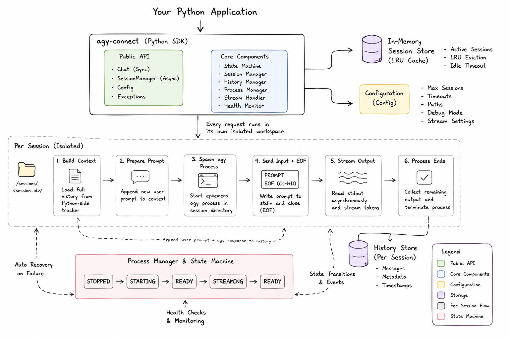

<div align="center">

# agy-connect


**A Python library that lets you use Antigravity CLI from Python with a clean API for chat, streaming, and session management.**

</div>


## Why agy-connect?

Instead of managing subprocesses, stdin/stdout, session recovery, streaming, and conversation state yourself, `agy-connect` provides a clean Python API so you can focus on building applications. 

**The biggest advantage:** You get programmatic access to state-of-the-art LLMs entirely for free through your local Antigravity CLI, without paying for API keys!

## Supported Models

Since `agy-connect` securely piggybacks off your local CLI, it supports all native Antigravity models:
- Gemini 3.5 Flash (Low, Medium, High)
- Gemini 3.1 Pro (Low, High)
- Claude Sonnet 4.6 (Thinking)
- Claude Opus 4.6 (Thinking)
- GPT-OSS 120B (Medium)

*Note: `agy-connect` uses whichever model is currently selected in your CLI. To change the model, simply open your terminal, run `agy`, type `/model` to select your desired LLM, and then restart your Python application.*

## Key Features

* **Zero API Key Requirement:** Use premium models natively without API costs.
* **Native Context Memory:** Preserves perfect conversation memory across requests.
* **Real-time Streaming:** Fetch tokens instantly using async generators (`chat.stream()`).
* **Session Management:** Built-in `SessionManager` utilizes LRU caching to manage hundreds of simultaneous chats efficiently.
* **Robust Process Management:** Handles batch processing intelligently with auto-recovery.
* **Dual API Support:** Complete support for both highly scalable `asyncio` applications and simple synchronous scripts.

## What can you build?
- ✓ Terminal chatbots
- ✓ FastAPI / Flask backends
- ✓ Discord / Slack bots
- ✓ Desktop assistants
- ✓ Automation agents
- ✓ CLI applications

---

## Installation

To install `agy-connect`, use `pip`:

```bash
pip install agy-connect
```

**Prerequisites:** You must have the [Antigravity CLI](https://antigravity.google/product/antigravity-cli) installed on your system.

### Verify Installation

After installation, you can easily verify that everything works:

```bash
python -c "from agy_connect import Chat; print(Chat().status())"
```
If `agy` is installed and authenticated correctly, you should see a status such as `READY`.

### Supported Platforms
- Windows
- Linux
- macOS

*Requires Python 3.9+*

---

## Usage & Quick Start

### 1. Synchronous Chatbot (Simple Scripts)
The `Chat` class provides an easy-to-use, blocking interface perfect for automation scripts.

```python
from agy_connect import Chat

def main():
    chat = Chat()
    print("User: Hello!")
    
    # Send a prompt and wait for the complete response
    response = chat.send("Hello!")
    print(f"Agy: {response}")
    
    # Context memory is naturally maintained!
    response2 = chat.send("What did I just say?")
    print(f"Agy: {response2}")
    
if __name__ == "__main__":
    main()
```

### 2. Streaming Responses
If you want to render text back to a user in real-time (like ChatGPT):

```python
import sys
from agy_connect import Chat

chat = Chat()

print("Agy: ", end="")
for chunk in chat.stream("Write a short poem about code."):
    sys.stdout.write(chunk)
    sys.stdout.flush()
print()
```

### 3. Asynchronous APIs (FastAPI / Web Servers)
For high-performance non-blocking code, use the `SessionManager`.

```python
import asyncio
from agy_connect import SessionManager, Config

async def run_server():
    # Configure session limits and timeouts
    config = Config(max_sessions=10, idle_timeout=300)
    manager = SessionManager(config)
    
    # Request a specific session (Memory is tied to "user_123")
    session = await manager.get("user_123")
    
    # Stream asynchronously
    async for chunk in session.stream("Explain asyncio."):
        print(chunk, end="", flush=True)
        
    # Cleanup memory
    await manager.shutdown()

asyncio.run(run_server())
```

### 4. Handling Exceptions
```python
from agy_connect import Chat
from agy_connect.exceptions import AgyNotInstalled

try:
    chat = Chat()
except AgyNotInstalled:
    print("Please install Antigravity CLI.")
```

---

## API Reference

The `Chat` and `Session` objects expose the following methods:

| Method | Description |
|--------|-------------|
| `send(prompt: str)` | Sends a prompt synchronously and returns the complete string response. |
| `stream(prompt: str)` | Generator that yields response tokens in real-time as they arrive. |
| `save(filename: str)` | Saves the entire conversation history to a JSON file on disk. |
| `load(filename: str)` | Reloads a previous conversation history from a JSON file. |
| `reset()` | Wipes the current session's memory/history completely. |
| `history()` | Returns the raw list of messages (dictionaries) in the current session. |
| `health()` | Returns real-time health metrics (PID, uptime, state, last errors). |
| `status()` | Returns the current string state of the adapter (e.g. `READY`, `BUSY`). |
| `restart()` | Forces a reboot of the underlying state machine and adapter. |
| `close()` / `shutdown()` | Gracefully cleans up all resources and background tasks. |

---

<div align="center">

## Architecture & Design



</div>

`agy-connect` uses an event-driven, state-machine architecture under the hood to ensure predictable process execution.

### The Problem it Solves
The current implementation is designed around Antigravity CLI's non-interactive execution behavior, which makes long-lived stdin/stdout sessions impractical. As a result, agy-connect uses isolated batch-mode sessions while preserving conversation context in Python.

### The Solution (Batch-Mode Strategy)
`agy-connect` embraces batch-mode processing using isolated workspaces.
1. When a new session is requested, a unique session folder is dynamically created (`/sessions/<session_id>`).
2. When a prompt is sent, `agy-connect` explicitly prepends the entire Python-side tracked history to ensure context isn't lost.
3. It spawns a fresh, ephemeral `agy` process in that directory, immediately flushes `stdin`, and sends an `EOF`.
4. It attaches an async reader to `stdout` to yield the tokens back to your application as `agy` generates them, then terminates the ephemeral process cleanly.

### State Machine
Every adapter tracks its state strictly using `agy_connect.constants`:
`STOPPED -> STARTING -> READY -> STREAMING -> READY`

---

## Configuration

You can customize the library's behavior entirely by injecting a `Config` object:

```python
from agy_connect import Chat, Config

config = Config(
    executable_path="/custom/path/to/agy", # Override auto-discovery
    idle_timeout=60,                       # Clean up session memory after 60s
    stream_chunk_size=512,                 # Byte sizes yielded during streams
    debug_mode=True                        # Enable verbose logger traces
)

chat = Chat(config)
```

---

## Contributing

Contributions, issues, and feature requests are welcome!
Feel free to check the [issues page](https://github.com/Prince-1652/agy-connect/issues).

## License

This project is [MIT](https://github.com/Prince-1652/agy-connect/blob/main/LICENSE) licensed.
